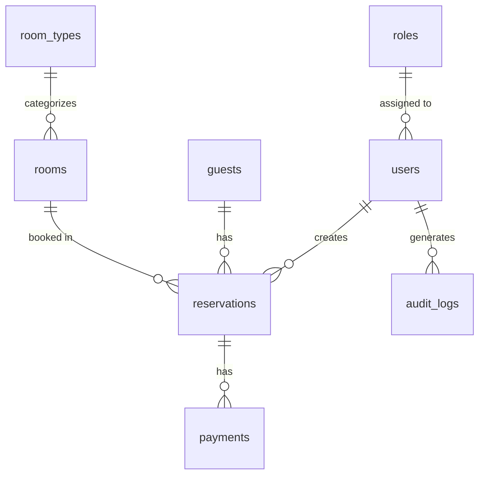

# Hotel Management System - Database

This directory contains the database schema and seed data for the Hotel Management System.

## Database Schema

The database schema includes the following tables:

- `users` - System users with authentication details
- `roles` - User roles and permissions
- `guests` - Guest information
- `room_types` - Different types of rooms with pricing
- `rooms` - Individual rooms with status and features
- `reservations` - Guest reservations
- `payments` - Payment records
- `audit_logs` - System audit trail

## Setup Instructions

### Prerequisites

- MySQL Server 8.0 or later
- MySQL Client (mysql command line tool)
- PowerShell 5.1 or later

### Initial Setup

1. Create the database:
   ```sql
   CREATE DATABASE IF NOT EXISTS HMSCORE2 CHARACTER SET utf8mb4 COLLATE utf8mb4_unicode_ci;
   ```

2. Update the database connection settings in the `.env` file if needed.

### Seeding the Database

To populate the database with sample data, run the seed script:

```powershell
# Navigate to the scripts directory
cd scripts

# Run the seed script
.\seed-database.ps1
```

This will:
1. Create sample room types (Standard, Deluxe, Suite, etc.)
2. Add sample rooms with different statuses
3. Create sample guest records
4. Generate sample reservations (past, current, and future)
5. Create corresponding payment records
6. Generate audit logs

### Sample Data Overview

- **Room Types**: 5 types (Standard, Deluxe, Suite, Family, Accessible)
- **Rooms**: 10 sample rooms across 5 floors
- **Guests**: 4 sample guest records
- **Reservations**: 4 sample reservations (past, current, future, cancelled)
- **Payments**: 4 sample payment records

### Database Diagram



## Troubleshooting

### Common Issues

1. **MySQL Service Not Running**
   - Ensure MySQL service is running: `Get-Service -Name "MySQL*"`
   - Start the service if needed: `Start-Service -Name "MySQL*"`

2. **Access Denied**
   - Verify the MySQL credentials in the script match your MySQL root user
   - Check if the user has sufficient privileges

3. **File Not Found**
   - Ensure you're running the script from the correct directory
   - Verify the path to the seed.sql file is correct

### Viewing Data

You can connect to the database using MySQL Workbench or the command line:

```bash
mysql -u root -p HMSCORE2
```

Then run queries to view the data:

```sql
-- View all rooms and their status
SELECT r.room_number, r.floor, r.status, rt.name as room_type, r.view
FROM rooms r
JOIN room_types rt ON r.room_type_id = rt.id
ORDER BY r.floor, r.room_number;

-- View current reservations
SELECT r.reservation_number, 
       CONCAT(g.first_name, ' ', g.last_name) as guest_name,
       ro.room_number,
       r.check_in_date,
       r.check_out_date,
       r.status,
       r.total_amount,
       r.paid_amount
FROM reservations r
JOIN guests g ON r.guest_id = g.id
JOIN rooms ro ON r.room_id = ro.id
WHERE r.check_out_date >= CURDATE()
ORDER BY r.check_in_date;
```

## Maintenance

### Updating Sample Data

1. Edit the `seed.sql` file to modify the sample data
2. Drop and recreate the database:
   ```sql
   DROP DATABASE IF EXISTS HMSCORE2;
   CREATE DATABASE HMSCORE2 CHARACTER SET utf8mb4 COLLATE utf8mb4_unicode_ci;
   ```
3. Run the seed script again

### Backup and Restore

To create a backup:
```bash
mysqldump -u root -p HMSCORE2 > backup_$(date +%Y%m%d).sql
```

To restore from a backup:
```bash
mysql -u root -p HMSCORE2 < backup_20230101.sql
```

## Security Notes

- The default script uses root credentials for simplicity. In production, use a dedicated database user with appropriate permissions.
- Never commit sensitive information like database passwords to version control.
- The seed script includes sample data that should be modified or removed before deploying to production.
